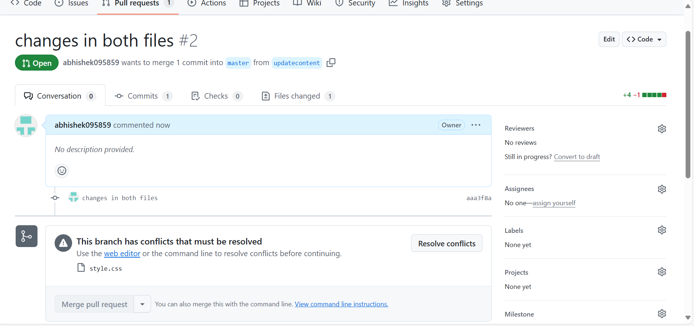
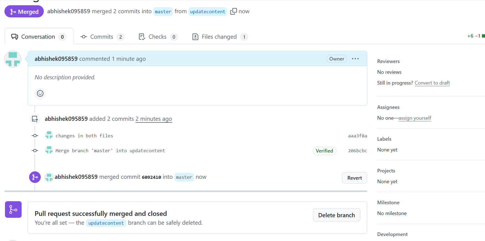

## Merge conflict and resolving process

## Merge conflict 

## Resolving process 

## Explanation of merge conflict
1. firstly create an html and css file by naming "index.html" and "style.css"
2. initalize the files by commanding "git init"
3. add the files "git add ."
4. commit the files
## create two new branches 
## changing the first branch
1. first branch name is update-styling 
2. make changes in "style.css"
3. add the file "git add style.css"
4. commit the file 
5. push the files into repository "git push origin update-styling"
## changing the second branch
1. name as add-content
2. make changes in both html and css files
3. add the files
4. commit the files
5. push to the repo
## pull request and merge
1. after push the pull request and merge the first branch
2. second pull request has conflict 
3. we have changed the "style.css" file two times 
4. to resolve the conflict we need to make changes manually in the file
5. then we need to merge the both files
